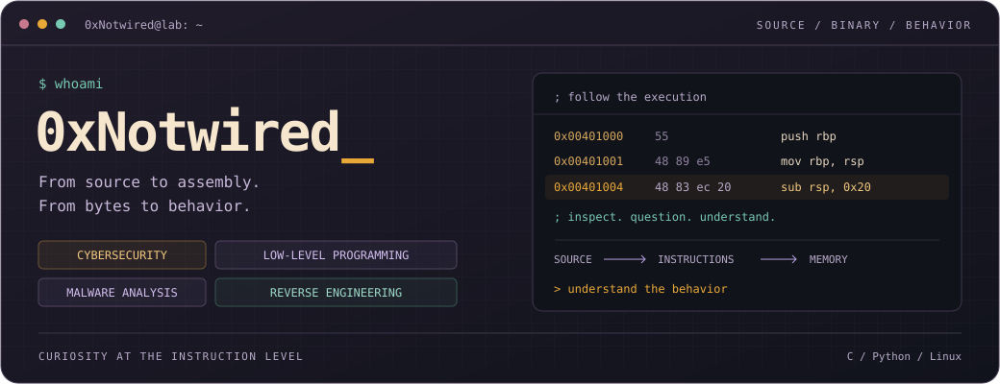

<div align="center">

<a href="https://github.com/0xNotwired">
  
</a>

# Samuel · 0xNotwired

**Cybersecurity · Low-level programming · Malware analysis · Reverse engineering**

[GitHub](https://github.com/0xNotwired) · [LinkedIn](https://www.linkedin.com/in/sramos10/)

</div>

---

### `$ whoami`

I'm Samuel, based in Argentina. I'm interested in understanding software from source code down to memory, machine instructions, and runtime behavior.

My focus is on cybersecurity and systems fundamentals: how programs work, how they fail, and what their binaries can tell us. I enjoy learning by reading code, building small experiments, and working through the details.

### `$ cat interests.md`

| Area | What draws me in |
| :--- | :--- |
| **Cybersecurity** | Vulnerability research, memory safety, attack surfaces, and understanding the assumptions behind secure systems. |
| **Low-level programming** | C, assembly, operating systems, memory management, and the boundary between software and hardware. |
| **Malware analysis** | Static and dynamic analysis, suspicious behavior, executable formats, and turning observations into an explanation. |
| **Reverse engineering** | Disassembly, debugging, control flow, and reconstructing how a program works from its binary. |

### `$ cat learning.log`

- **Below the source:** connecting C code with assembly, memory layout, and execution.
- **Inside the OS:** processes, virtual memory, system calls, and how programs interact with the kernel.
- **Inside the binary:** exploring ELF and PE files, tracing control flow, and understanding runtime behavior.

### `$ cat ~/.stack`

```text
languages   C · Python
environment Linux · fish · Git
workspace   Helix · Zellij · Obsidian
exploring   Assembly · binary analysis · OS internals
```

### `$ ./connect`

Interested in exchanging notes, discussing systems internals, or learning together?
Find me on [GitHub](https://github.com/0xNotwired) or [LinkedIn](https://www.linkedin.com/in/sramos10/).

---

<div align="center">
  <sub><code>Read the source. Trace the execution. Understand the behavior.</code></sub>
</div>
